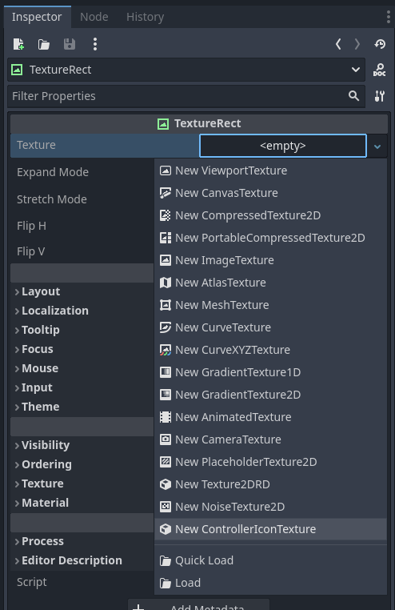
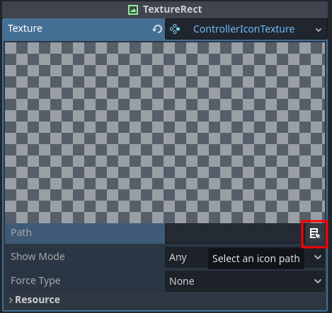
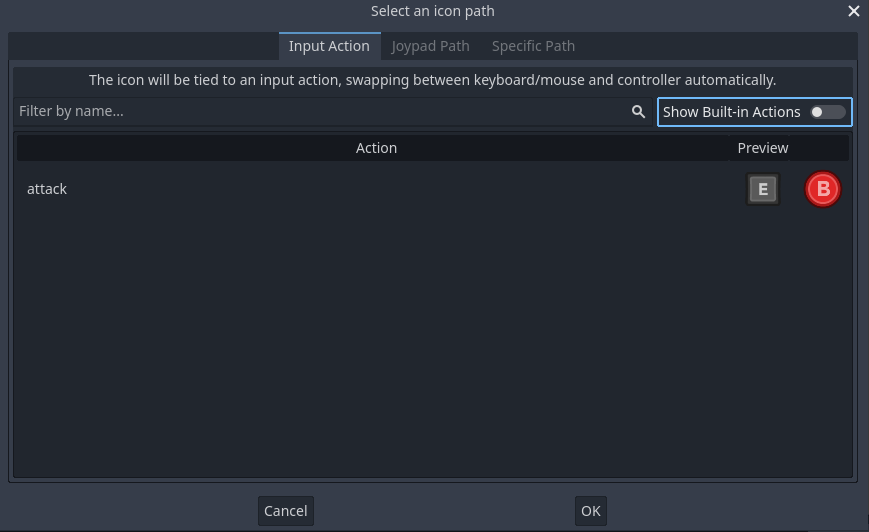
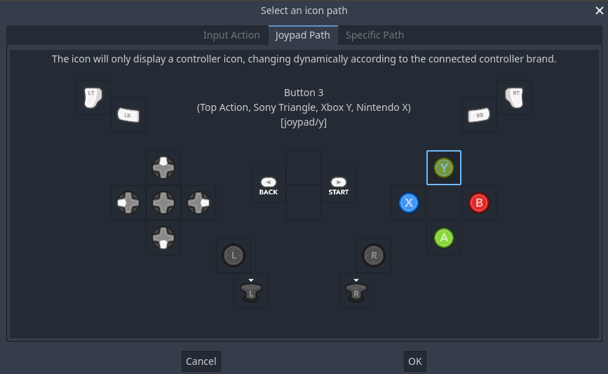
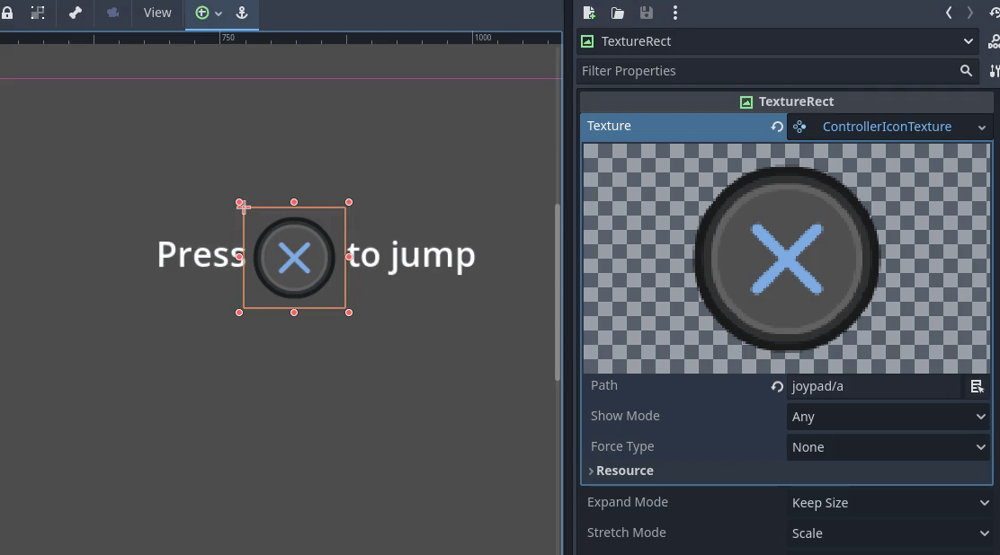
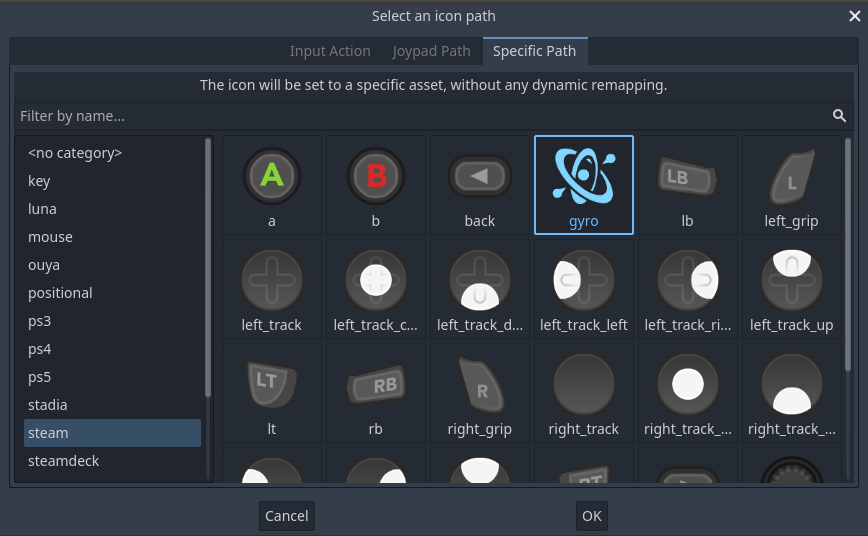
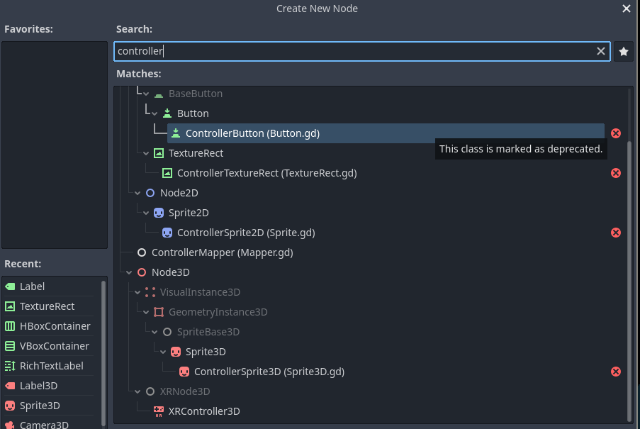
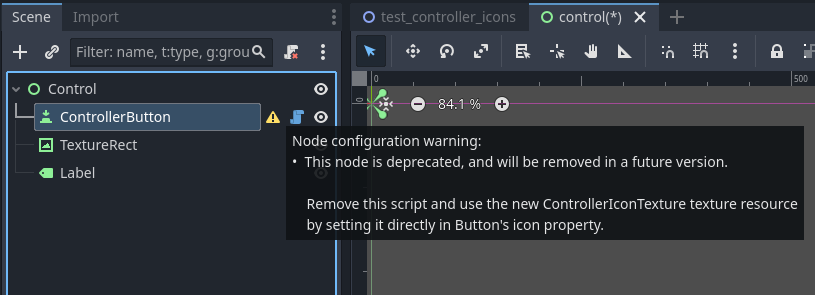

# Controller Icons - Documentation

## Contents

- [Quick-start guide](#quick-start-guide)
	- [Input action](#input-action)
	- [Generic joypad path](#generic-joypad-path)
	- [Specific path](#specific-path)
- [Reacting to input change](#reacting-to-input-change)
- [Settings](#settings)
- [Adding/removing controller iconss](#addingremoving-controller-icons)
- [Changing controller mapper](#changing-controller-mapper)
- [TTS support](#tts-support)
- [Porting addon versions](#porting-addon-versions)
	- [v2.x.x to v3.0.0](#v2xx-to-v300)
	- [v1.x.x to v2.0.0](#v1xx-to-v200)


# Quick-start guide

Controller Icons provides a new Texture2D resource, `ControllerIconTexture`, which displays the correct icon for the current input device. This can be used in any node that accepts a Texture2D, such as `TextureRect`, `Button`, `Sprite2D/3D`, `RichTextLabel`, etc...

> [!TIP]
> The `demo` folder contains some scenes showcasing and explaining how to use the addon as well.

> [!WARNING]
> The existing objects before version 3.0.0 (`ControllerButton`, `ControllerTextureRect`, `ControllerSprite2D`, `ControllerSprite3D`) should no longer be used as they are deprecated, and will be removed in a future version. For help in porting your project, refer to [Porting addon versions](#porting-addon-versions).



The following properties are available:
- `Path`: Specify the controller lookup path
- `Show Mode`: Set the input type this icon will appear on. When set to `Keyboard/Mouse` or `Controller`, the object will hide when the opposite input method is used.
- `Force Type`: When set to other than `None`, forces the displayed icon to be either `Keyboard/Mouse` or `Controller`. Only relevant for input actions, other types of lookup paths are not affected by this.
- `Custom Label Settings`: When text rendering is needed for multi-icon prompts, the texture uses the addon's settings by default. If you want to override for this particular icon, you can specify it here.


The `Path` is the most relevant property, as it specifies what icons to show. It can be one of three major categories, detailed below. You can use the builtin tool for picking paths, or write it manually as well.



> [!NOTE]
> If you add/remove/change input actions on the editor, you will need to reload the addon so it can update the input map and show the appropriate mappings in the editor view again. This is not needed in the launched project though.
>
> However, if you change input actions at runtime, you must call `refresh` on the `ControllerIcons` singleton to update all existing icons with the new actions:
>
> ```gdscript
> ControllerIcons.refresh()
> ```

## Input action

You can specify the exact name of an existing input action in your project. This is the recommended approach, as you can easily change the controls and have the icons remap automatically between keyboard/mouse and controller.




## Generic joypad path

If you want to only use controller icons, you can use a generic mapping, which automatically changes to the correct icons depending on the connected controller type.





## Specific path

You can also directly use the icons by specifying their path. This lets you use more custom icons which can't be accessed from generic scenarios:




To know which paths exist, check the `assets` folder from this addon. The path to use is the path to an image file, minus the base path and extension. So for example, to use `res://addons/controller_icons/assets/switch/controllers_separate.png`, the path is `switch/controllers_separate`

# Reacting to input change

The `ControllerIcons` singleton has an `input_type_changed` signal available so you can detect when the type of input device changes:

```gdscript
func my_func():
	...
	ControllerIcons.input_type_changed.connect(_on_input_type_changed)

func _on_input_type_changed(input_type: ControllerIcons.InputType, controller: int):
	match input_type:
		ControllerIcons.InputType.KEYBOARD_MOUSE:
			# Input changed to keyboard/mouse
			...
		ControllerIcons.InputType.CONTROLLER:
			# Input changed to a controller
			...

```
# Settings

There is a settings resource file at `res://addons/controller_icons/settings.tres` which you can open and modify to tweak the addon's behavior:


- **General**
	- `Joypad Fallback`: To what default controller type fallback to if automatic controller type detection fails.
	- `Joypad Deadzone`: Controller's deadzone for analogue inputs when detecting input device changes.
	- `Allow Mouse Remap`: If set, consider mouse movement when detecting input device changes.
	- `Mouse Min Movement`: Minimum "instantaneous" mouse speed in pixels to be considered for an input device change
- **Custom Assets**
	- `Custom Asset Dir`: Directory with custom controller icons to use. Refer to [Adding/removing controller icons](#addingremoving-controller-icons) for more instructions on how to do this.
	- `Custom Mapper`: Custom generic path mapper script to use. Refer to [Changing controller mapper](#changing-controller-mapper) for more instructions on how to do this.
	- `Custom Icon Extension`: Custom icon file extension to use. If empty, the addon defaults to `png`. Must be the extension portion only, without the preceding dot.
- **Text Rendering**
	- `Custom Label Settings`: Custom `LabelSettings` to use for text rendering on multi-icon prompts. Will be used by all icons by default, but can also be overridden on a per-icon basis.

# Adding/removing controller icons

To remove controller icons you don't want to use, delete those files/folders from `res://addons/controller_icons/assets`. You might need to create a custom mapper in order to prevent the addon from trying to use deleted icons. For more information, refer to [Changing controller mapper](#changing-controller-mapper).

To add or change controller icons, while you can do it directly in the `assets` folder, you can intead set a custom folder for different assets. When set, the addon will look for icons in that folder first, and if not found, fallback to the default assets folder. Do to this, set the `Custom Asset Dir` field from [Settings](#settings) to your custom icons folder. It needs to have a similar structure to the addon's assets folder.

# Changing controller mapper

The default mapper script maps generic joypad paths to a lot of popular controllers available. However, you may need to override how this mapping process works.

You can do so by creating a script which extends `ControllerMapper`:

```gdscript
extends ControllerMapper

func _convert_joypad_path(path: String, device: int, fallback: ControllerSettings.Devices) -> String:
	var controller_name = Input.get_joy_name(device)
	# Support for the new hot Playstation 42 controller
	if "PlayStation 42 Controller" in controller_name:
		return path.replace("joypad/", "playstation42/")
	# else return default mapping
	return super._convert_joypad_path(path, fallback)
```

The only function that's mandatory is `_convert_joypad_path`. This supplies a [generic joypad `path`](#generic-joypad-path), which you then need to convert to a [specific path](#specific-path) for the desired controller assets. Check out the the default implementation at `res://addons/controller_icons/Mapper.gd` to see how the default mapping is done.

* `device` is the device index. It will be `0` for the first connected controller, `1` for the 2nd, and so on. If the path originates from an input action conversion, which accepts input from "All Devices", `device` will be `-1`.
* `fallback` is the fallback device type if automatic detection fails. There's not much need to use this if you're writing a custom mapper, but it is needed for the default mapping process.

If you do not wish to fully replace the original mapper, you can still fallback to the default mapper by calling the parent's method (`return super._convert_joypad_path(path, fallback)`).

You then have to set the addon to use this mapper by setting its path in `res://addons/controller_icons/settings.tres`, in the **Custom Mapper** property of the **Custom Assets** group. 

# TTS support

Text-to-speech (TTS) is supported by the addon. To fetch a TTS representation of a given icon, you can call the texture's `get_tts_string()` method:

```gdscript
var tts_text = texture.get_tts_string()
```

This TTS text takes into consideration the currently displayed icon, and will thus be different if the icon is from keyboard/mouse or controller. It also takes into consideration the controller type, and will thus use native button names (e.g. `A` for Xbox, `Cross` for PlayStation, etc).

You can also request to convert an icon path directly throuh the `ControllerIcons` singleton:

```gdscript
func _ready():
	# Input Action - Will switch based on active keyboard/mouse or controller
	var tts_text = ControllerIcons.parse_path_to_tts("attack")

	# Generic Joypad Path - Will switch based on active controller
	var tts_text = ControllerIcons.parse_path_to_tts("joypad/a")

	# Specific Path
	var tts_text = ControllerIcons.parse_path_to_tts("xbox360/a")
	var ttx_text = ControllerIcons.parse_path_to_tts("key/z")
```

# Porting addon versions

This section details porting instructions between breaking changes of the addon. If you're updating multiple versions, you should start at your current version, and work your way up to the latest version.

## v2.x.x to v3.0.0

Version 3.0.0 represents a very large breaking change due to an internal refactor of the addon. The most impactful change is that the existing objects before version 3.0.0 (`ControllerButton`, `ControllerTextureRect`, `ControllerSprite2D`, `ControllerSprite3D`) should no longer be used as they are deprecated, and will be removed in a future version.




To update these objects, remove their script, and assign a new `ControllerIconTexture` to it. The given warning also gives more specific instructions on what do to for each particular object.

Beyond that, the remaining properties and behavior remain largely the same. However, there are still some minor changes of note:

- The `show_only` property was renamed to `show_mode`. If you access this property directly in your code, you'll need to update it.
- The `show_mode` and `force_type` properties now use enums (`ShowMode` and `ForceType` respectively), instead of `int` values. If you access these properties directly in your code, you'll need to update them.
- The `max_width` property, only available in `ControllerTextureRect`, was removed. Use the related properties like `expand_mode` and `custom_minimum_size` instead.

## v1.x.x to v2.0.0

- The `ControllerSetting.Devices` enum had some dangling values removed, which changed the order of a few existing keys. If you rely on these values, you'll need to update your code:
	- The `VITA`, `WII` and `WIIU` values were removed. These were not used anywhere in the addon, so you shouldn't be affected by this.
	- The preceding enum keys had their values changed by this: `XBOX360`, `XBOXONE`, `XBOXSERIES` and `STEAM_DECK` enum values have changed. If you use these values directly in your code, you'll need to update them.
	- The default settings file (`settings.tres`) will need to be updated, as the `Joypad Fallback` setting depends on this.
- Some Nintendo Switch asset filenames were renamed. If you use these assets directly in your project, you'll may need to re-add them:
	- `switch/lb.png` -> `switch/l.png`
	- `switch/rb.png` -> `switch/r.png`
	- `switch/lt.png` -> `switch/zl.png`
	- `switch/rt.png` -> `switch/zr.png`
