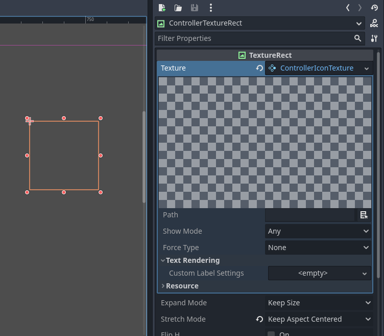
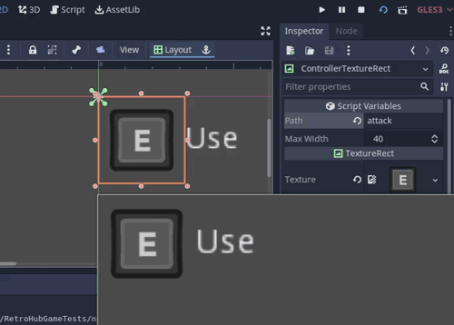
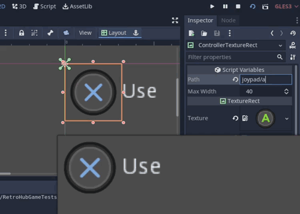

# Controller Icons - Documentation

## Contents

- [Quick-start guide](#quick-start-guide)
	- [Input action](#input-action)
	- [Generic joypad path](#generic-joypad-path)
	- [Specific path](#specific-path)
- [Reacting to input change](#reacting-to-input-change)
- [Settings](#settings)
- [Adding/removing controller iconss](#addingremoving-controller-icons)
- [Changing controller mapper](#changing-controller-mapper)
- [Generic path lookup](#generic-path-lookup)


# Quick-start guide

Controller Icons provides various custom node types:

- `ControllerButton` _(`Button`)_
- `ControllerTextureRect` _(`TextureRect`)_
- `ControllerSprite2D` _(`Sprite2D`)_
- `ControllerSprite3D` _(`Sprite3D`)_

All of these provide the following properties:
- `Path`: Specify the controller lookup path
- `Show Only`: Set the input type this icon will appear on. When set to `Keyboard/Mouse` or `Controller`, the object will hide when the opposite input method is used.
- `Force Type`: When set to other than `None`, forces the displayed icon to be either `Keyboard/Mouse` or `Controller`. Only relevant for input actions, other types of lookup paths are not affected by this.

ControllerTextureRect has the following additional properties:
- `Max Width`: Max width for the icon to occupy, in pixels.



`Path` can be one of three major categories, detailed below.

## Input action

You can set `Path` to the exact name of an existing input action in your project. This is the recommended approach, as you can easily change the controls and have the icons remap automatically.

This mode also automatically switches icons when the user either uses keyboard/mouse or controller if the action is mapped to that device as well.



If you add/remove/change input actions on the editor, you need to reload the addon so it can update the input map and show the appropriate mappings in the editor view again. This is not needed in the launched project though.

However, if you change input actions at runtime, you must call `refresh` on the `ControllerIcons` singleton to update all existing icons with the new actions:

```gdscript
ControllerIcons.refresh()
```

## Generic joypad path

If you want to use only controller icons, you can use generic mappings, which automatically change to the correct icons depending on the connected controller type.



The list of generic paths available, as well as to which icons they map per controller, can be checked at [Generic path lookup](#generic-path-lookup).

## Specific path

As a last resource, you can directly use the icons by specifying their path. This lets you use more custom icons which can't be accessed from generic paths:


To know which paths exist, simply check the `assets` folder from this addon. The path to use is the path to an image file, minus the base path and extension. So for example, to use `res://addons/controller_icons/assets/switch/controllers_separate.png`, the path is `switch/controllers_separate`

# Reacting to input change

The `ControllerIcons` singleton has an `input_type_changed` signal available so you can detect when the type of input device changes:

```gdscript
func my_func():
	...
	ControllerIcons.input_type_changed.connect(_on_input_type_changed)

func _on_input_type_changed(input_type):
	match input_type:
		ControllerIcons.InputType.KEYBOARD_MOUSE:
			# Input changed to keyboard/mouse
			...
		ControllerIcons.InputType.CONTROLLER:
			# Input changed to a controller
			...

```
# Settings

There is a settings resource file at `res://addons/controller_icons/settings.tres` which you can open and modify to tweak the addon's behavior:


- `Joypad Fallback`: To what default controller type fallback to if automatic controller type detection fails.
- `Joypad Deadzone`: Controller's deadzone for analogue inputs when detecting input device changes.
- `Allow Mouse Remap`: If set, consider mouse movement when detecting input device changes.
- `Mouse Min Movement`: Minimum "instantaneous" mouse speed in pixels to be considered for an input device change
- `Custom Asset Dir`: Directory with custom controller icons to use. Refer to [Adding/removing controller icons](#addingremoving-controller-icons) for more instructions on how to do this.
- `Custom Mapper`: Custom generic path mapper script to use. Refer to [Changing controller mapper](#changing-controller-mapper) for more instructions on how to do this.

# Adding/removing controller icons

To remove controller icons you don't want to use, simply delete those files/folders from `res://addons/controller_icons/assets`.

To add or change controller icons, while you could do so directly in the `assets` folder, it's better to set a custom folder for different assets.

Set the `Custom Asset Dir` field from [Settings]() to your custom icons folder. It needs to have a similar structure to the existing assets folder.

# Changing controller mapper

The default mapper maps generic joypad paths to a bunch of popular controllers available. However, you may wish to override this mapping process.

You can do so by creating a script which extends `ControllerMapper`:

```gdscript
extends ControllerMapper

func _convert_joypad_path(path: String, fallback: int) -> String:
	var controller_name = Input.get_joy_name(0)
	# I want to support the hot new Playstation 42 controller
	if "PlayStation 42 Controller" in controller_name:
		return path.replace("joypad/", "playstation42/")
	# else return default mapping
	return ._convert_joypad_path(path, fallback)
```

The only function that's mandatory is `_convert_joypad_path`. This supplies a generic joypad `path`, which you need to convert to the controller's desired path. Have a look at the default implementation at `res://addons/controller_icons/Mapper.gd` to see how the default mapping is done.

`fallback` is the fallback device type if automatic detection fails. There's not much need to use this is you're writing a custom mapper, but it's needed for the default mapping process.

If you do not wish to fully replace the original mapper and instead only want to add detection to new controller types, don't forget to fallback to the default mapper by calling the parent's method (`return ._convert_joypad_path(path, fallback)`)

# Generic path lookup

Below is a table of the existing generic joypad paths, as well as to what icons they map for each controller type shipped.

If you want to populate the missing entries, feel free to open a PR!

### Buttons

| Generic path | Godot joypad index | Xbox 360 | Xbox One | Xbox Series | PlayStation 3 | PlayStation 4 | PlayStation 5 | Nintendo Switch Controller | Nintendo Switch Joy-Con | Steam Controller | Steam Deck | Amazon Luna | Google Stadia |
| --- | --- | --- | --- | --- | --- | --- | --- | --- | --- | --- | --- | --- | --- |
| joypad/a | 0 |  |  |  |  |  |  |  |  |  |  |  |  |
| joypad/b | 1 |  |  |  |  |  |  |  |  |  |  |  |  |
| joypad/x | 2 |  |  |  |  |  |  |  |  |  |  |  |  |
| joypad/y | 3 |  |  |  |  |  |  |  |  |  |  |  |  |
| joypad/lb | 4 |  |  |  |  |  |  |  |  |  |  |  |  |
| joypad/rb | 5 |  |  |  |  |  |  |  |  |  |  |  |  |
| joypad/lt | 6 |  |  |  |  |  |  |  |  |  |  |  |  |
| joypad/rt | 7 |  |  |  |  |  |  |  |  |  |  |  |  |
| joypad/l_stick_click | 8 |  |  |  |  |  |  | N/A | N/A | N/A |  |  | N/A |
| joypad/r_stick_click | 9 |  |  |  |  |  |  | N/A | N/A |  |  |  | N/A |
| joypad/select | 10 |  |  |  |  |  |  |  |  |  |  |  |  |
| joypad/start | 11 |  |  |  |  |  |  |  |  |  |  |  |  |
| joypad/dpad | N/A |  |  |  |  |  |  |  |  |  |  |  |  |
| joypad/dpad_up | 12 |  |  |  |  |  |  |  |  |  |  |  |  |
| joypad/dpad_down | 13 |  |  |  |  |  |  |  |  |  |  |  |  |
| joypad/dpad_left | 14 |  |  |  |  |  |  |  |  |  |  |  |  |
| joypad/dpad_right | 15 |  |  |  |  |  |  |  |  |  |  |  |  |
| joypad/home | 16 | N/A | N/A | N/A | N/A | N/A | N/A |  |  |  |  | N/A |  |
| joypad/share | 17 | N/A | N/A |  | N/A | N/A |  |  |  | N/A |  |  |  |

### Axis

| Generic path | Godot joypad axis | Xbox 360 | Xbox One | Xbox Series | PlayStation 3 | PlayStation 4 | PlayStation 5 | Nintendo Switch Controller | Nintendo Switch Joy-Con | Steam Controller | Steam Deck | Amazon Luna | Google Stadia |
| --- | --- | --- | --- | --- | --- | --- | --- | --- | --- | --- | --- | --- | --- |
| joypad/l_stick | 0, 1 |  |  |  |  |  |  |  |  |  |  |  |  |
| joypad/r_stick | 2, 3 |  |  |  |  |  |  |  |  |  |  |  |  |
| joypad/lt | 6 |  |  |  |  |  |  |  |  |  |  |  |  |
| joypad/rt | 7 |  |  |  |  |  |  |  |  |  |  |  |  |