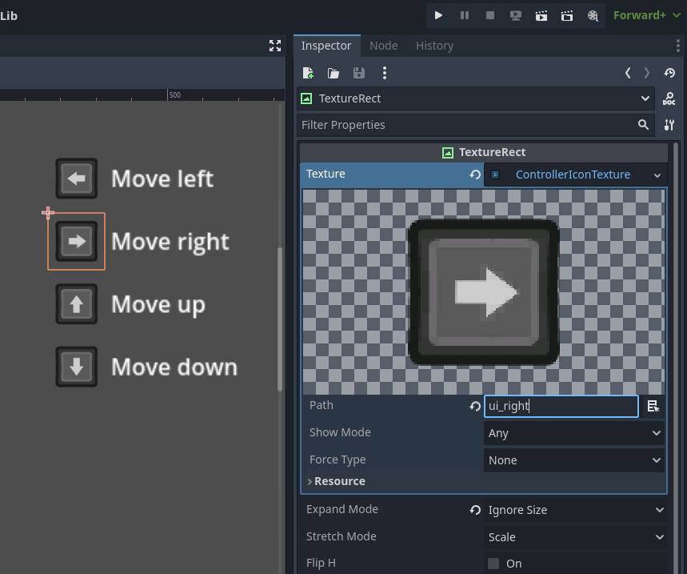
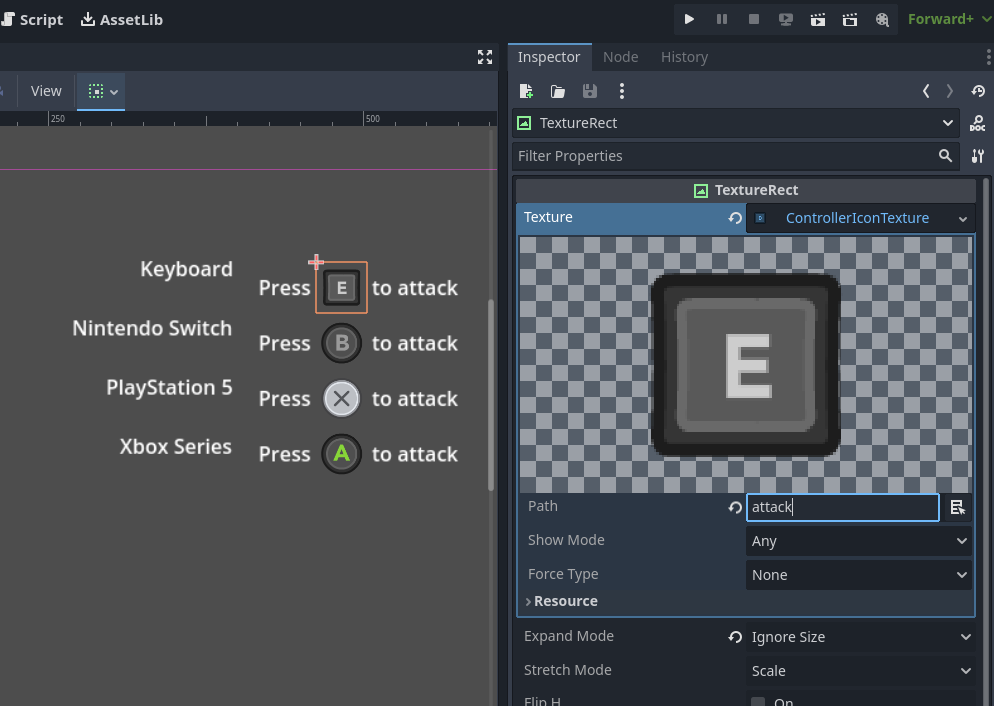
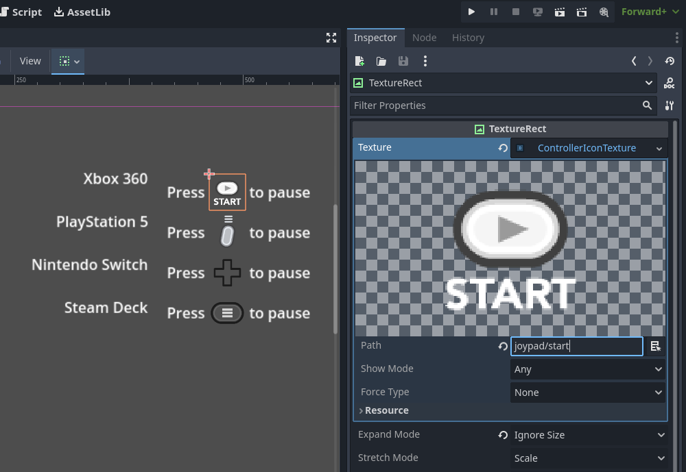

# Controller Icons

Provides icons for all major controllers and keyboard/mouse actions, with an automatic icon remapping system.

> This is the Godot 3.x version. For the Godot 4.x version, check the [master branch](https://github.com/rsubtil/controller_icons/tree/master)

> [!WARNING]
> **This version (v2.x.x) is the last major update for the 3.x version. This branch will only receive small features and critical bug fixes from now on.**
>
> With the internal refactor from v3.0.0, the addon changed significantly from previous versions. Thus, no further development will be done in the 3.x branch due to various reasons:
> - Version 3.0.0 does not change any behavior from 2.x.x, so there's no major benefit to end-users in porting these new changes.
> - The internal refactor will allow to implement future features more easily, which are significantly harder to do with Godot 3.
> - Godot 4 adoption has been faster than expected, with [>75% of Godot users](https://docs.google.com/forms/d/e/1FAIpQLSeXRE1nF64PUilO6fA7Pevh2lWukJtpdBvc2_A3fGfuciy-gQ/viewanalytics) already having moved on to Godot 4.

## Features

- Parse input actions and assign respective icons for keyboard/mouse and controller

- Automatically detects input between keyboard/mouse and controller and switches icons on-the-fly corresponding to the controller's type

- Handles generic controller paths to support many different button icons

- Ships with default assets for keyboard and mouse, and most popular controllers:
	- Xbox 360
	- Xbox One
	- Xbox Series
	- PlayStation 3
	- PlayStation 4
	- PlayStation 5
	- Nintendo Switch Controller / Joy-Con
	- Steam Controller
	- Steam Deck
	- Amazon Luna
	- Google Stadia
	- OUYA

## Installation

> This is the Godot 3.x version. For the Godot 4.x version, check the [master branch](https://github.com/rsubtil/controller_icons/tree/master)

The minimum Godot version is 3.3, but has been tested successfully on 3.4 and 3.5.

Download this repository and copy the `addons` folder to your project root directory.

Then activate **Controller Icons** in your project plugins.

## Usage

Check the full [docs](DOCS.md), which has a [Quick-Start guide](DOCS.md#quick-start-guide) to get you up to speed.

## Credits

- Thank you [@adambelis](https://github.com/adambelis) for the redesigned logo!
- Thank you [@el-falso](https://github.com/el-falso) for the port to Godot 4!

## License

The addon is licensed under the MIT license. Full details at [LICENSE](LICENSE).

The controller assets are [Xelu's FREE Controllers & Keyboard PROMPTS](https://thoseawesomeguys.com/prompts/), made by Nicolae (XELU) Berbece and under Creative Commons 0 _(CC0)_.

The icon was designed by [@adambelis](https://github.com/adambelis) ([#5](https://github.com/rsubtil/controller_icons/pull/5)) and is under Create Commons 0 _(CC0)_. It uses the [Godot's logo](https://github.com/godotengine/godot/blob/master/icon.svg) which is under Creative Commons Attribution 4.0 International License _(CC-BY-4.0 International)_